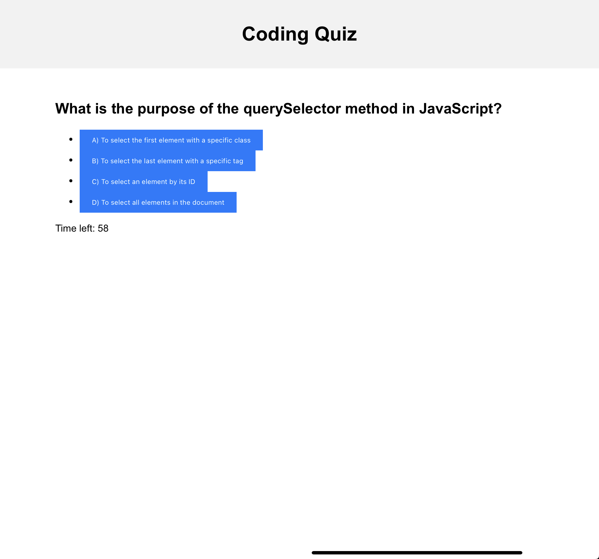

# Coding Quiz App

## Description

This web application allows coding boot camp students to take a timed quiz on JavaScript fundamentals. The app features a clean, polished, and responsive user interface. After completing the quiz, users can store their high scores along with their initials for comparison with their peers.

## Live Demo

Check out the live demo of the application [here](https://nfjsg.github.io/CodeQuizGame/).

## Table of Contents

- [Installation](#installation)
- [Usage](#usage)
- [Features](#features)
- [Contributing](#contributing)
- [License](#license)

## Installation

1. Clone the repository: `git clone https://github.com/your-username/your-repo.git`
2. Navigate to the project directory: `cd your-repo`
3. Open `index.html` in your preferred web browser.

## Usage

1. Click the "Start Quiz" button to begin the quiz.
2. Answer the multiple-choice questions presented to you.
3. If you answer a question incorrectly, time will be subtracted from the clock.
4. The game ends when all questions are answered or the timer reaches 0.
5. After the game ends, you can save your initials and score.

## Features

- Dynamic updating of HTML and CSS using JavaScript.
- Responsive design for optimal user experience on various devices.
- Timer functionality to keep track of the remaining time.
- High score storage using `localStorage`.

## Contributing

Contributions are welcome! If you have any suggestions or improvements, please create a pull request. For major changes, please open an issue first to discuss what you would like to change.

## License

This project is licensed under the [MIT License](LICENSE).
